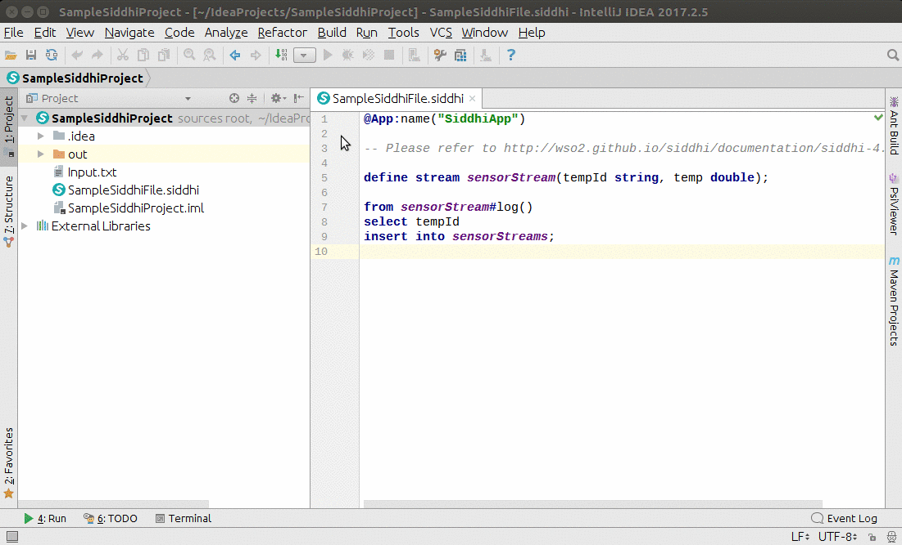
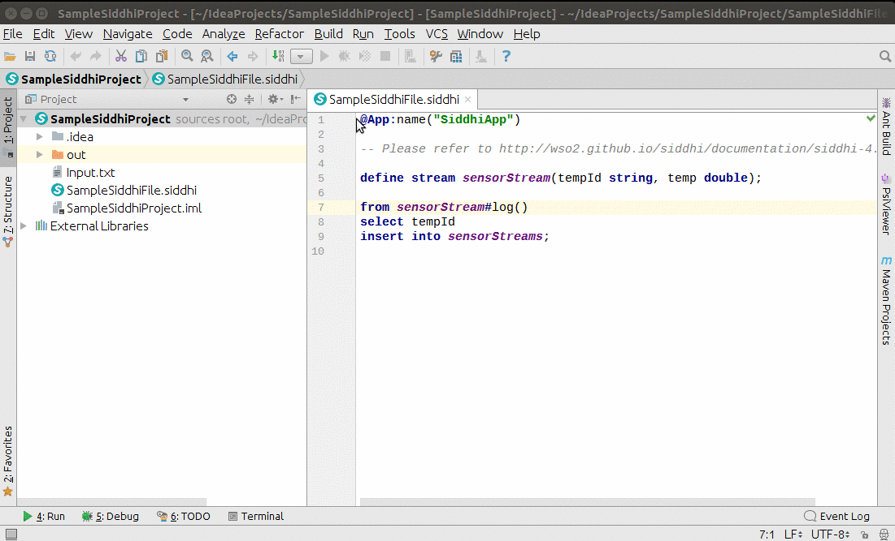
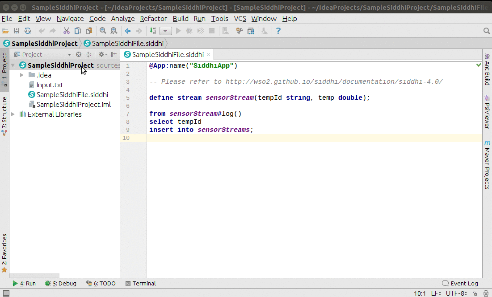
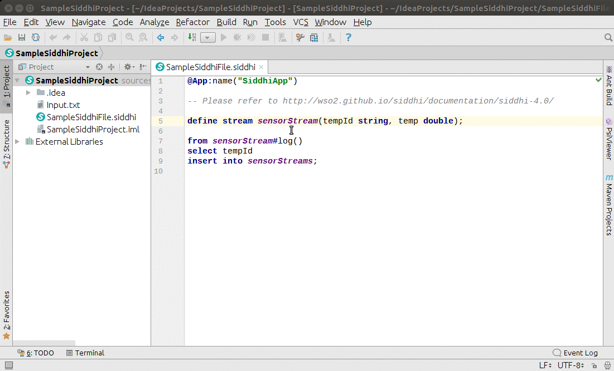

# Features

## Running Siddhi programs 

You can run Siddhi files by adding a configuration.

## Debugging Siddhi programs 

You can debug Siddhi files.

## File Templates

1) Siddhi Main - Contains a sample siddhi file with only app annotation.

## Spell Checking

Spell checking is enabled for all identifiers.

