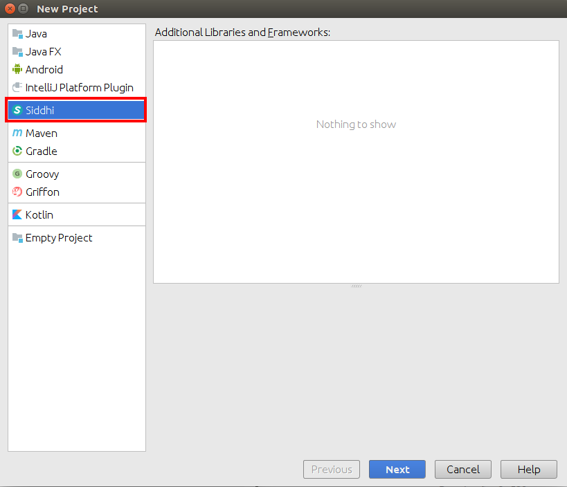
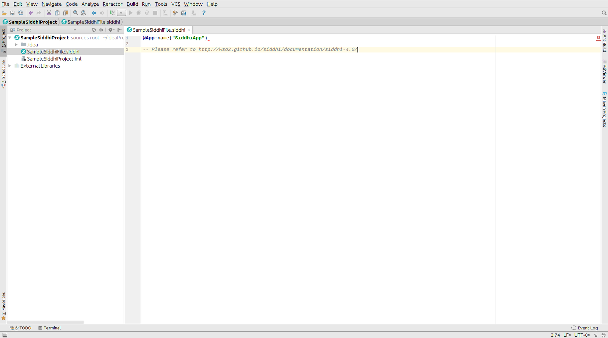
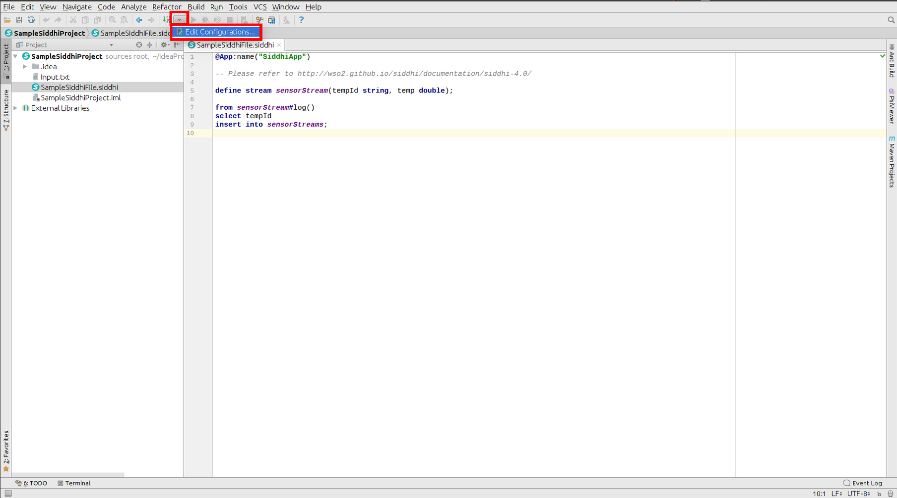
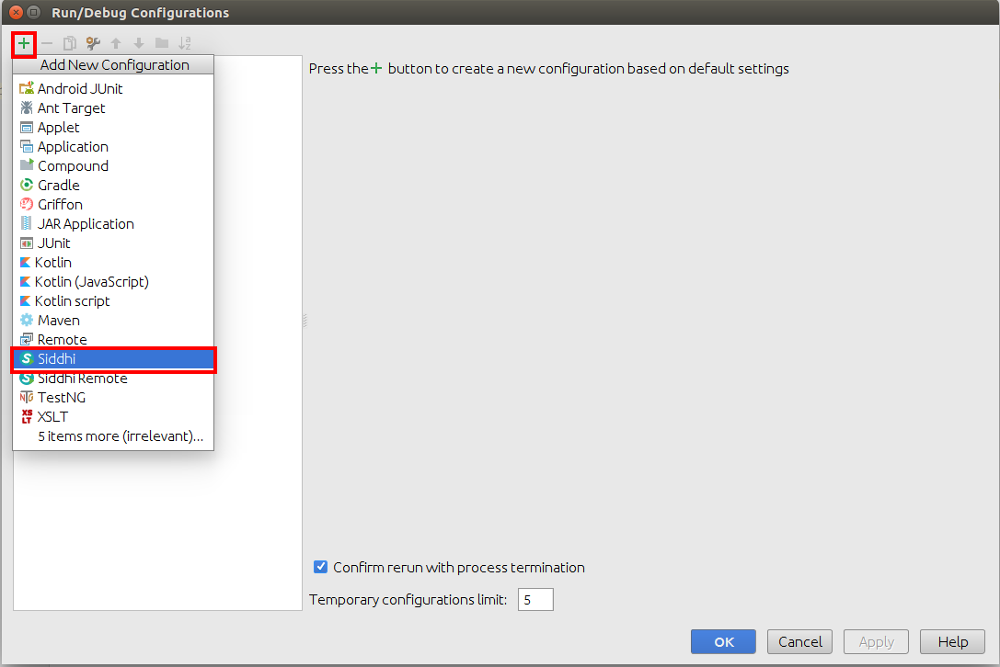
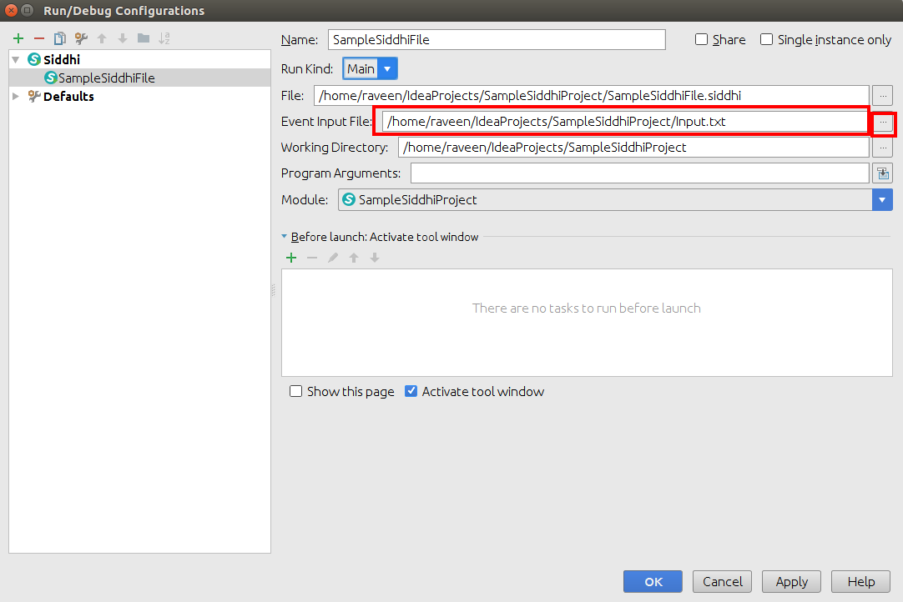
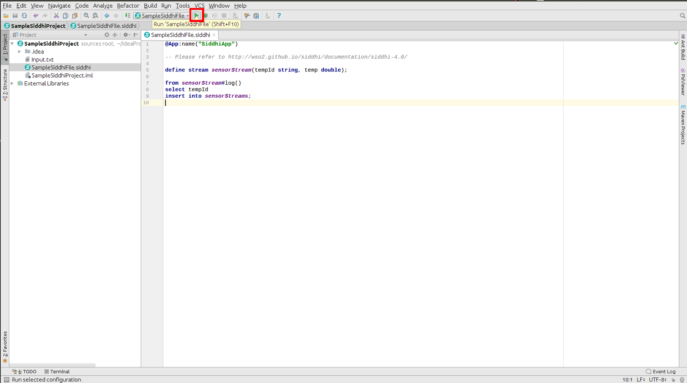
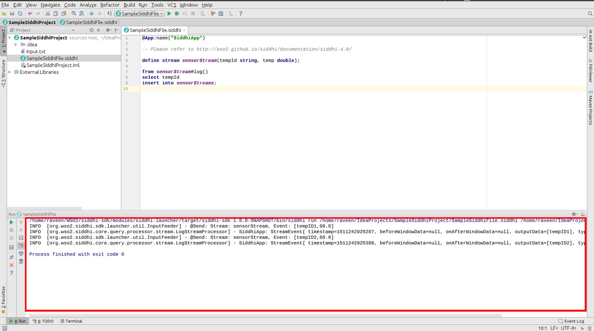
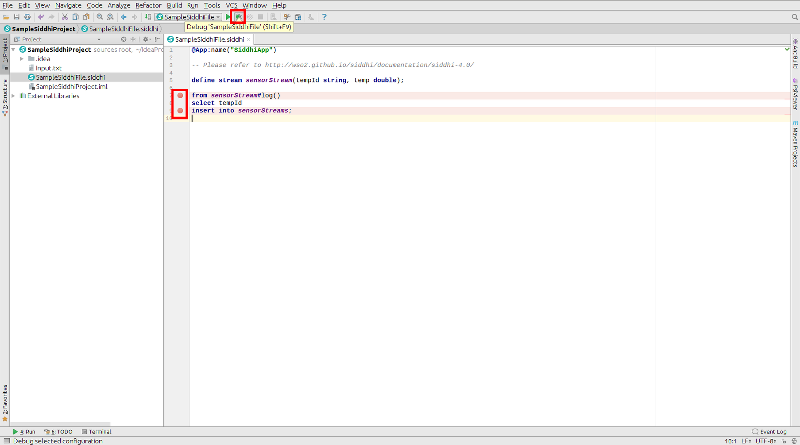

# Writing a sample program in Siddhi

## Creating a new Siddhi project

1. Go to **File -> New -> Project**. Select **Siddhi** project type and click **Next** button.

2. In the next step, we are prompted to select a SDK for the project. If you haven't already added a SDK, please 
follow [Setting up Siddhi SDK](../setting-up-siddhi-sdk) documentation to add a new SDK.

   Select the SDK and click **Next** button.

3. Update the project name and the location and click **Next** button.

Now you have successfully created a new **Siddhi** project.

## Creating a new Siddhi file

1. **Right click** on the project and select **New -> Siddhi File**.

2. Enter the file name and click **OK** button. This will create a new file 
with the default app annotation.

Now you should have a new Siddhi file with the default app annotation.

## Running Siddhi files

1. Write a sample siddhi program as shown in below.

2. Write a event input file(input.txt) as shown in below.

**NOTE:** You don't need to define an input.txt file, if you are getting events through an extension.   

3. Select **Edit Configurations** from the toolbar.

4. Click **+** button and select **Siddhi** to add a siddhi ***run/debug configuration***.

5. Provide a name for the configuration and select the siddhi file from the file chooser.  

6. Select the event input file from the file chooser and click **OK**.  

**NOTE:** You don't need to select an input.txt file, if you are getting events through an extension. 

Near the main function, in the gutter area, **Run** icon can be found.

7. Select **Run** command. This will run the Siddhi file. 

8. The output will be shown in the **Run** window.

## Debugging Siddhi files

* Use the above provided(described under **Running Siddhi files**) sample siddhi file and event input file for this as 
well.

**NOTE:** You don't need to define an input.txt file, if you are getting events through an extension.  

* Provide a run/debug configuration (described under **Running Siddhi files** step 3-6)  if you haven't configured yet.

1. Add breakpoints as shown in below and select **Debug** command. This will start the debug process.

**NOTE** Siddhi only allows to add breakpoints on the beginning of a query input section or on the beginning of a 
query output. 

2. The output will be shown in the **Debug** window.

